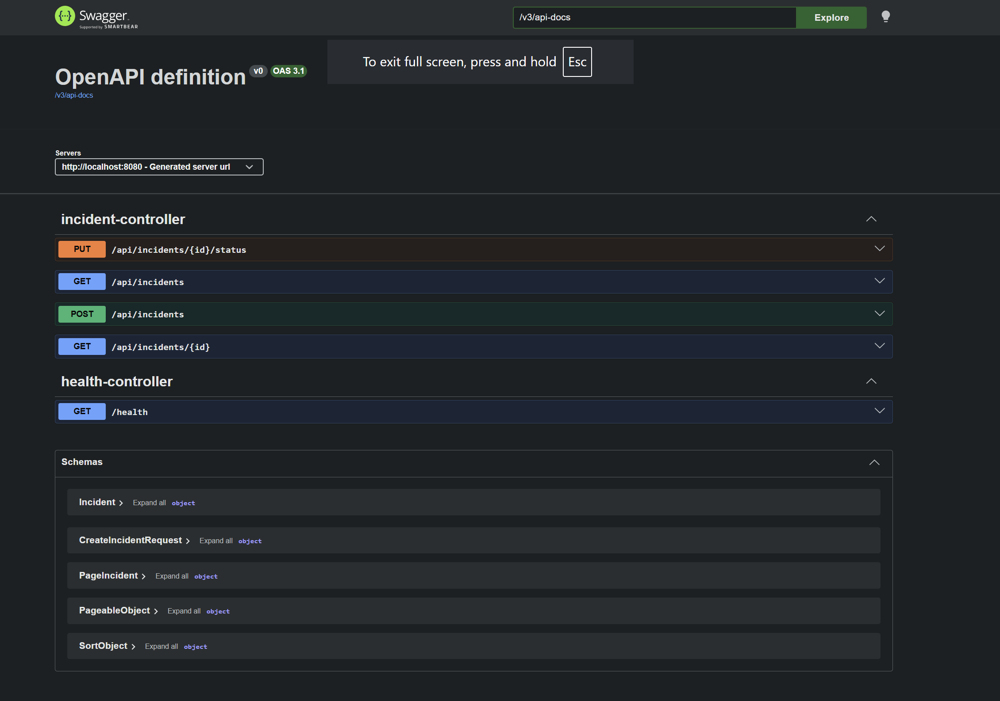
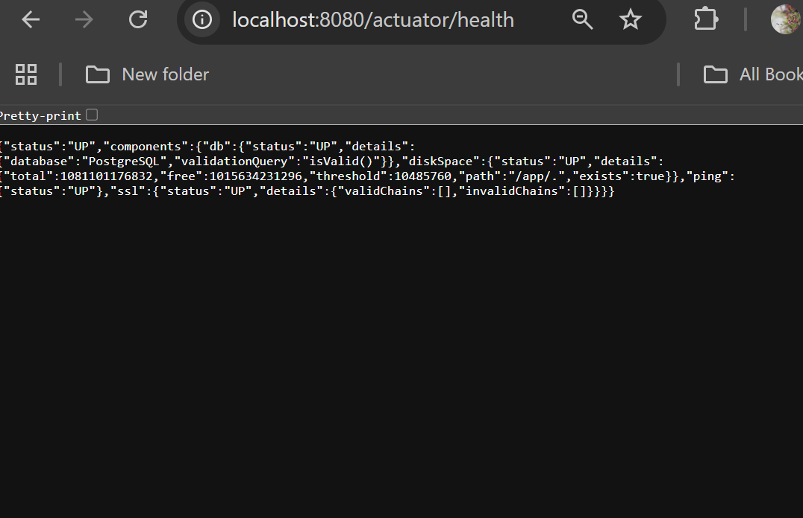
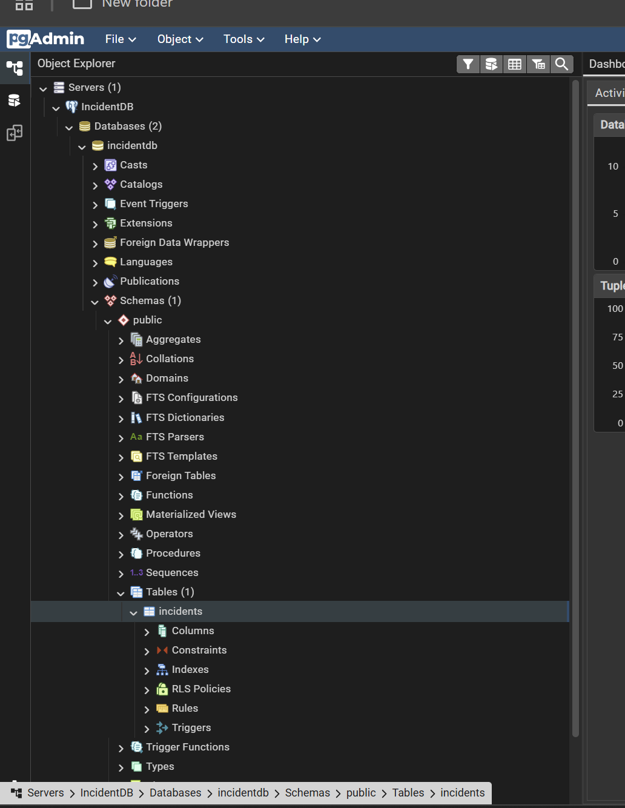
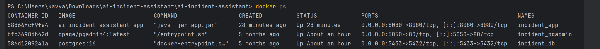

# AI Incident Assistant

A backend-focused Incident Management system built using Java Spring Boot and PostgreSQL.

The project demonstrates production-style backend development including REST APIs, validation, exception handling, pagination, filtering, Dockerized deployment, monitoring, and PostgreSQL integration.

---

## Technologies

- Java 17
- Spring Boot 3
- Spring Data JPA
- PostgreSQL 16
- Docker
- Docker Compose
- pgAdmin
- Spring Boot Actuator
- Swagger / OpenAPI

---

## Features

- Create incidents
- View incidents
- Update incident status
- Filter by status
- Filter by severity
- Pagination support
- Global exception handling
- Request validation
- PostgreSQL persistence
- Swagger API documentation
- Dockerized deployment
- Health monitoring using Spring Boot Actuator

---

## Project Structure

```
Client
      │
      ▼
Spring Boot REST API
      │
      ▼
Spring Data JPA
      │
      ▼
PostgreSQL
      │
      ▼
Docker
```

---

## API Endpoints

| Method | Endpoint | Description |
|---------|----------|-------------|
| GET | /health | Health Check |
| POST | /api/incidents | Create Incident |
| GET | /api/incidents | List Incidents |
| GET | /api/incidents/{id} | Get Incident |
| PUT | /api/incidents/{id}/status | Update Status |
| GET | /actuator/health | Application Health |

---

## Filtering

```
GET /api/incidents?status=OPEN
```

```
GET /api/incidents?severity=HIGH
```

---

## Pagination

```
GET /api/incidents?page=0&size=5
```

---

## Running the Project

### Start PostgreSQL

```bash
docker compose up -d
```

---

### Build Project

```bash
./mvnw clean package
```

---

### Start Application

```bash
docker compose up --build
```

---

## Swagger

```
http://localhost:8080/swagger-ui/index.html
```

---

## Actuator

```
http://localhost:8080/actuator/health
```

---

## Database

PostgreSQL is containerized using Docker Compose.

Database:

```
incidentdb
```

pgAdmin:

```
http://localhost:5050
```

---
## Screenshots

### Swagger UI



---

### Application Health (Spring Boot Actuator)



---

### PostgreSQL Database (pgAdmin)



---

### Docker Containers


## Future Enhancements

- JWT Authentication
- Role-Based Access Control
- AI-powered Incident Resolution Assistant
- Prometheus & Grafana Monitoring
- CI/CD with GitHub Actions
- Cloud Deployment (AWS/Azure)

---

## Author

Kavya Saraboju

## Academic Supervision

This project was developed as part of my Volunteer Research Assistant work in the Department of Computer Science at Southern Illinois University Edwardsville.

Academic Supervisor:

Professor Dr Mark McKenney